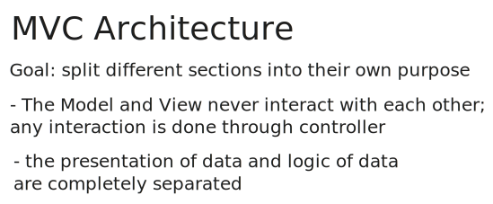
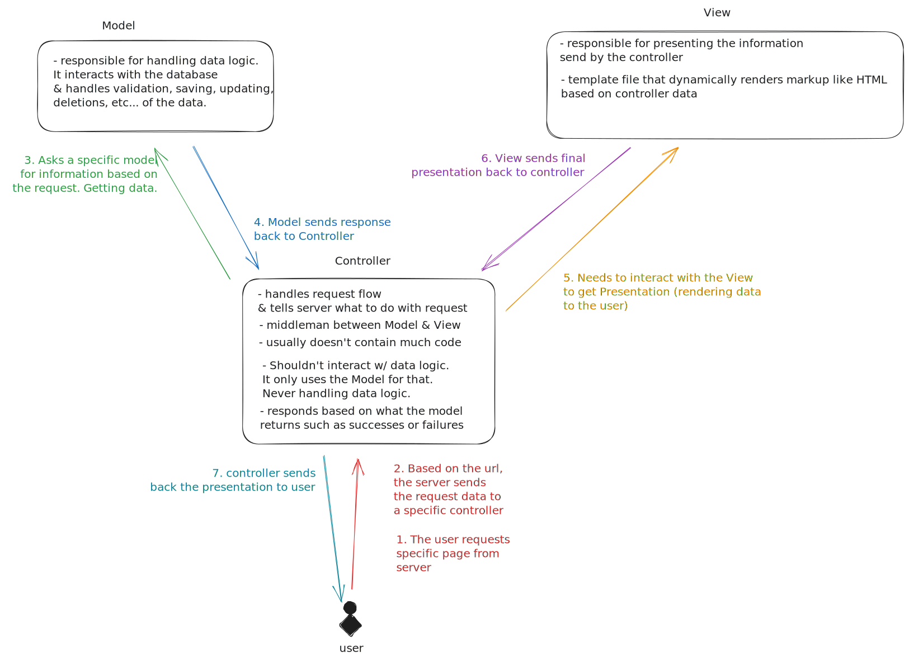

# My Notes

## Pre-requisites

- [] Understand MVC Architecture
- [] Learn how to use Postman and/or CURL to make a request to my RESTful API
- [] Learn to leverage ChatGPT to generate server code

## How does MVC works?





See [EXAMPLES.md](./EXAMPLES.md)

## Helpful Links

## ChatGPT Prompts

```
Give me an example of MVC architecture in typescript server
```
